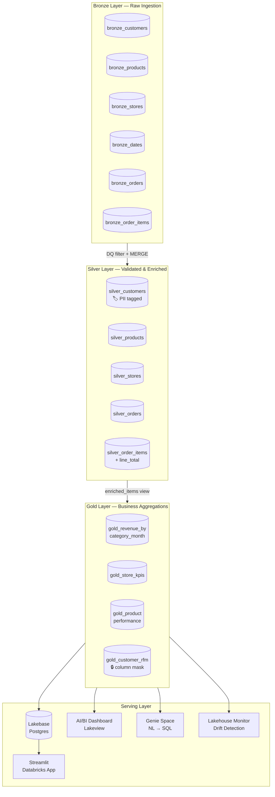
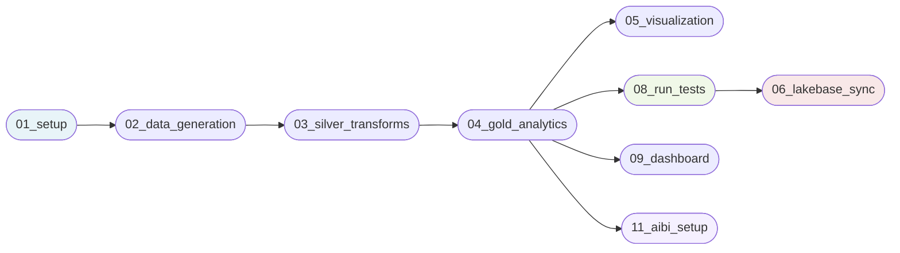
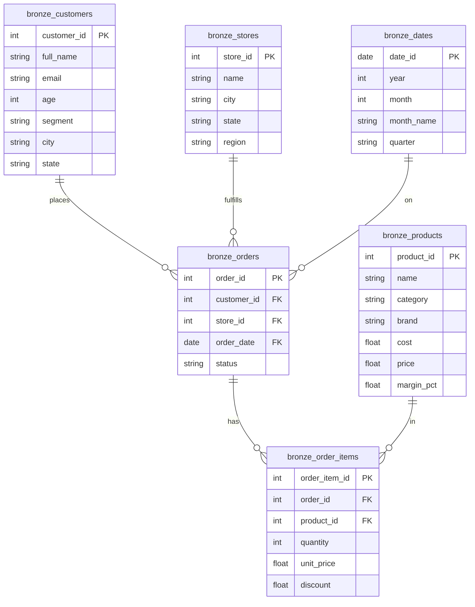
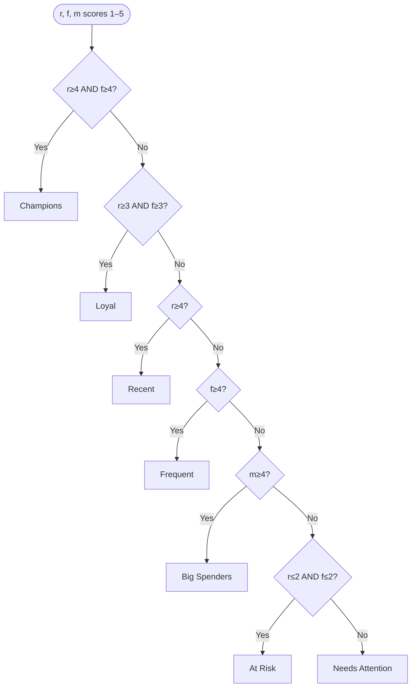
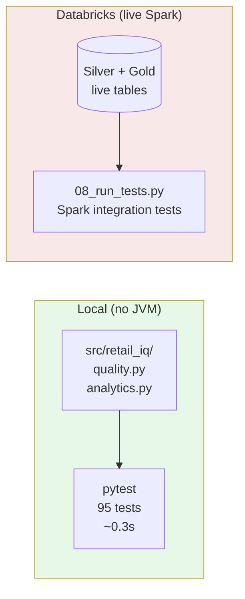
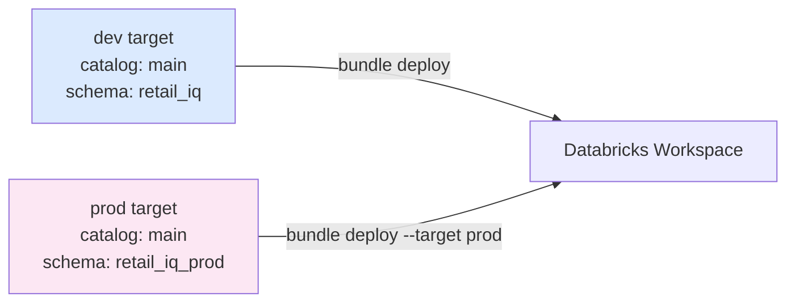

# RetailIQ Analytics Pipeline

A production-grade retail analytics platform built on Databricks, implementing a
**Bronze → Silver → Gold medallion architecture** with RFM customer segmentation,
store KPI aggregation, Unity Catalog governance, AI/BI self-serve analytics, and a
live Postgres serving layer via Lakebase.

---

## Architecture Overview



---

## Pipeline DAG



`run_tests` is a quality gate — `lakebase_sync` only runs after all integration tests pass.
A **separate nightly job** runs `07_maintenance` (OPTIMIZE + ANALYZE) off the critical path.

---

## Data Model



---

## RFM Segmentation Logic



Scores are computed with `NTILE(5)` window functions — relative to the full customer
base, not absolute thresholds.

---

## Project Structure

```
retail-iq/
├── databricks.yml                  # Bundle definition (dev/prod targets)
├── pytest.ini
├── notebooks/
│   ├── 00_utils.py                 # Shared: tbl(), upsert(), LOAD_TS
│   ├── 01_setup.py                 # Schema creation, CDF enable, mask_pii function, group
│   ├── 02_data_generation.py       # Synthetic Bronze data (Faker); unit_price from catalog
│   ├── 03_silver_transforms.py     # DQ filter → Silver (MERGE + Liquid Cluster)
│   ├── 04_gold_analytics.py        # Aggregations → Gold + UC governance + Lakehouse Monitor
│   ├── 05_visualization.py         # Matplotlib charts
│   ├── 06_lakebase_sync.py         # Gold → Lakebase Postgres (staging rename, zero downtime)
│   ├── 07_maintenance.py           # Nightly OPTIMIZE + ANALYZE (off critical path)
│   ├── 08_run_tests.py             # Spark integration tests (quality gate before sync)
│   ├── 09_dashboard.py             # KPI dashboard + solution evaluation
│   ├── 10_lakebase_grant_app.py    # One-time: grant app SP Postgres access
│   └── 11_aibi_setup.py            # AI/BI Dashboard (Lakeview) + Genie Space creation
├── apps/
│   └── retail_insights/
│       ├── app.py                  # Streamlit app — connects via Lakebase secret PAT
│       ├── app.yml                 # Minimal: command: [streamlit, run, app.py]
│       └── requirements.txt
├── resources/
│   ├── retail_pipeline_job.yml     # Main pipeline DAG (8 tasks)
│   └── retail_maintenance_job.yml  # Nightly maintenance schedule
├── src/
│   └── retail_iq/
│       ├── __init__.py
│       ├── analytics.py            # rfm_segment(), line_total(), gross_profit()
│       └── quality.py              # customer/product/order/item DQ predicates
└── tests/
    ├── conftest.py
    ├── test_gold_analytics.py      # 50 RFM + revenue math tests
    ├── test_silver_transforms.py   # 40 DQ predicate tests
    └── test_utils.py               # 5 tbl() format tests
```

---

## Quick Start

### Prerequisites

- [Databricks CLI v0.200+](https://docs.databricks.com/dev-tools/cli/index.html)
- Python 3.9+ with `pytest` for local tests

### Deploy

```bash
# Authenticate (one-time)
databricks auth login --host https://dbc-85cda355-cf23.cloud.databricks.com

# Deploy to dev (default target)
databricks bundle deploy

# Deploy to prod (isolated schema: retail_iq_prod)
databricks bundle deploy --target prod
```

### Run the pipeline

```bash
# Full pipeline run (dev) — all 8 tasks
databricks bundle run retail_pipeline

# Individual task
databricks bundle run retail_pipeline --task gold_analytics
```

### Local unit tests (no Spark required)

```bash
pip install pytest
pytest -v
# 95 tests in ~0.3s
```

---

## Notebooks

| # | Notebook | Runtime | Purpose |
|---|---|---|---|
| 00 | `00_utils` | — | Shared `tbl()`, `upsert()`, `LOAD_TS` via `%run` |
| 01 | `01_setup` | ~30s | Schema, CDF enable, `mask_pii` function, `retail_iq_analysts` group |
| 02 | `02_data_generation` | ~2 min | Generate 1K customers, 100 products, 10K orders |
| 03 | `03_silver_transforms` | ~3 min | DQ filter, dedup, `line_total` derivation, MERGE |
| 04 | `04_gold_analytics` | ~2 min | 4 Gold tables, `enriched_items` view, UC governance, Lakehouse Monitor |
| 05 | `05_visualization` | ~1 min | 5 Matplotlib charts |
| 06 | `06_lakebase_sync` | ~3 min | Gold → Lakebase staging/atomic rename (zero downtime) |
| 07 | `07_maintenance` | ~5 min | Nightly OPTIMIZE + ANALYZE (separate schedule) |
| 08 | `08_run_tests` | ~3 min | Integration tests — quality gate before Lakebase sync |
| 09 | `09_dashboard` | ~2 min | KPI dashboard + solution evaluation |
| 10 | `10_lakebase_grant_app.py` | one-time | Grant app service principal Postgres access |
| 11 | `11_aibi_setup` | ~1 min | Lakeview AI/BI Dashboard + Genie Space |

---

## Self-Serve Analytics

### AI/BI Dashboard (Lakeview)

Created automatically by `11_aibi_setup`. Three pages backed by live Gold tables:

| Page | Widgets |
|---|---|
| Revenue | Bar chart — revenue by category × month; Pie — revenue share by category |
| Stores | Horizontal bar — top stores by revenue, colored by region |
| Customers | Bar — customers by RFM segment; Bar — avg lifetime spend by segment |

### Genie Space

Natural-language interface over all four Gold tables. Ask questions in plain English:

- *"Which product category had the highest revenue last month?"*
- *"How many Champion customers do we have and what is their average spend?"*
- *"Which stores have the highest average basket size?"*
- *"What percentage of customers are At Risk?"*

Pre-loaded with 7 curated sample questions visible to all users on entry.

---

## Unity Catalog Governance

| Feature | Where applied | Detail |
|---|---|---|
| `mask_pii` function | `main.retail_iq` schema | Members of `retail_iq_analysts` group (or admins) see real values; everyone else sees `****` |
| PII tags | `silver_customers.email`, `silver_customers.full_name` | Tags enable lineage and discovery in the UC data catalog |
| Column masks | `gold_customer_rfm.email`, `gold_customer_rfm.full_name` | Masks on the analyst-facing Gold layer (not Silver — Silver is pipeline-internal) |
| Table comments | All four Gold tables | Searchable descriptions in the UC catalog |
| Column comments | `gold_customer_rfm` key columns | Definitions for `rfm_segment`, `rfm_score`, `recency_days`, `frequency`, `monetary` |
| Change Data Feed | All Gold tables | Required for Lakebase Synced Tables continuous sync |

To grant analyst access:
```sql
ALTER GROUP retail_iq_analysts ADD USER <user@example.com>;
```

### Lakehouse Monitor

`04_gold_analytics` attaches a snapshot monitor to `gold_customer_rfm`. It generates:
- A monitoring dashboard (`gold_customer_rfm Monitoring`) with column distributions
- Drift alerts when RFM segment distributions shift between runs

---

## Streamlit App (Lakebase)

The `apps/retail_insights` Streamlit app connects to Lakebase Postgres and serves:
- Revenue trends by category and month
- Store leaderboard with region filter
- RFM segment distribution + avg spend
- Product performance with margin analysis

### Auth pattern

The app's auto-generated service principal cannot access Lakebase directly (Lakebase
validates at the Databricks auth layer, not the Postgres role level). The solution:

1. Owner's PAT is stored in Databricks Secrets (`scope=retail-insights`, `key=lakebase-token`)
2. The SP fetches the PAT and constructs a user-level `WorkspaceClient`
3. M2M env vars (`DATABRICKS_CLIENT_ID`, `DATABRICKS_CLIENT_SECRET`) are temporarily popped
   before construction to avoid the "more than one auth method" SDK error

### Deploy the app

```bash
databricks bundle run retail_insights
```

---

## Configuration

### Bundle variables

| Variable | Default | Description |
|---|---|---|
| `catalog` | `main` | Unity Catalog name |
| `schema` | `retail_iq` | Schema (dev) / `retail_iq_prod` (prod) |

### Data generation parameters

| Parameter | Default | Description |
|---|---|---|
| `num_customers` | 1000 | Number of synthetic customers |
| `num_products` | 100 | Number of products in catalog |
| `num_stores` | 20 | Number of retail store locations |
| `num_orders` | 10000 | Number of completed/returned/cancelled orders |

---

## Test Strategy



**Local tests** verify pure business logic (DQ predicates, RFM segment rules, revenue math)
without a JVM, making CI fast and reliable.

**Integration tests** run as the final pipeline task (quality gate before `lakebase_sync`) and assert:
- Silver tables pass all DQ rules (no nulls, no out-of-range values, valid emails)
- `line_total` formula matches expected values within 1 cent
- `unit_price` stays within 95–100 % of catalog price
- Gold `gross_profit` is positive for > 90 % of products
- CDF is enabled on all Gold tables
- RFM segments cover all customers with completed orders

---

## Key Design Decisions

### `enriched_items` temp view

All four Gold queries once re-scanned `silver_orders` and `silver_order_items`
independently. A single `CREATE OR REPLACE TEMP VIEW enriched_items` with the
`status = 'completed'` filter pre-join eliminates 3 out of 4 redundant full-table scans.

### Liquid Clustering vs. Partition By

Silver and Gold tables use `CLUSTER BY` instead of `PARTITION BY`. Unlike static
partitioning, Liquid Clustering rebalances files automatically as data grows and
supports multiple cluster columns without the small-file problem that afflicts
high-cardinality partitions.

### Zero-downtime Lakebase sync

The sync notebook writes to `{table}_staging`, then performs an atomic rename
per table. App queries to Postgres never see a "table does not exist" gap.
Monitor output tables (`_profile_metrics`, `_drift_metrics`) are excluded from
sync — their struct/array columns are not compatible with psycopg2.

### Column masks on Gold, not Silver

PII masks belong on `gold_customer_rfm` (the analyst-facing layer), not
`silver_customers`. Masking Silver breaks the email-validity integration test
because the pipeline queries Silver internally without going through the mask.

### Maintenance off the critical path

`OPTIMIZE` runs in a separate nightly job (`07_maintenance`), not inline in the
pipeline. The pipeline finishes ~5 minutes faster per run and OPTIMIZE is not
blocked by pipeline failures.

### `unit_price` tied to catalog price

`unit_price = catalog_price × uniform(0.95, 1.0)` ensures prices are always above
cost (a Silver DQ rule), making `gross_profit` reliably positive and meaningful
for margin analysis.

---

## Environment Isolation



Dev and prod write to different schemas. A prod deploy never touches dev data.

---

## Solution Evaluation

### Performance

| Metric | Before | After |
|---|---|---|
| Silver table scans (per pipeline) | 10 re-scans post-upsert | 0 (counts captured pre-upsert) |
| Gold table scans of orders + items | 4× each | 1× via `enriched_items` view |
| OPTIMIZE blocking pipeline | Yes (~5 min) | No (nightly maintenance job) |
| Lakebase sync downtime | Table dropped and recreated | Atomic staging rename — zero downtime |

### Quality

- 95 local unit tests cover DQ predicates, RFM rules, and revenue math
- Integration tests gate `lakebase_sync` — no bad data reaches Postgres
- `gross_profit <= 0` check in Gold notebook and integration tests catches pricing regressions
- Silver filter rules reject nulls, invalid emails, out-of-range ages, negative costs
- Lakehouse Monitor auto-detects RFM distribution drift between pipeline runs

### Cost (Databricks free edition)

- All tasks use **serverless compute** — no cluster startup overhead, billed per DBU-second
- OPTIMIZE and ANALYZE are off the critical path to avoid wasting DBUs after every run
- Widgets allow scaling `num_orders` down (e.g. 1000) for development iteration
