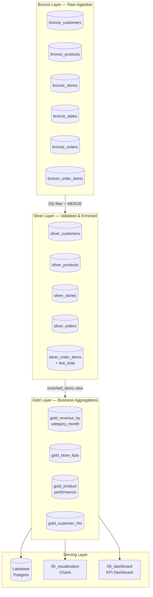
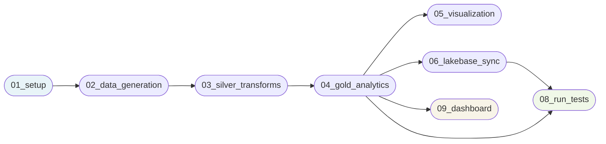
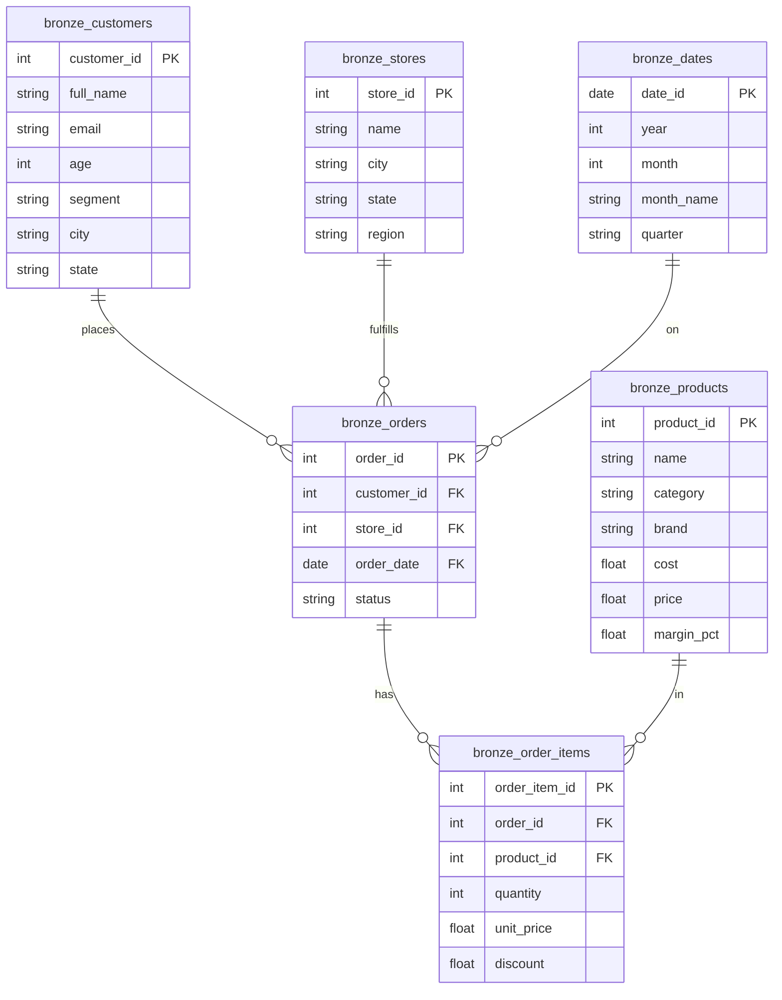
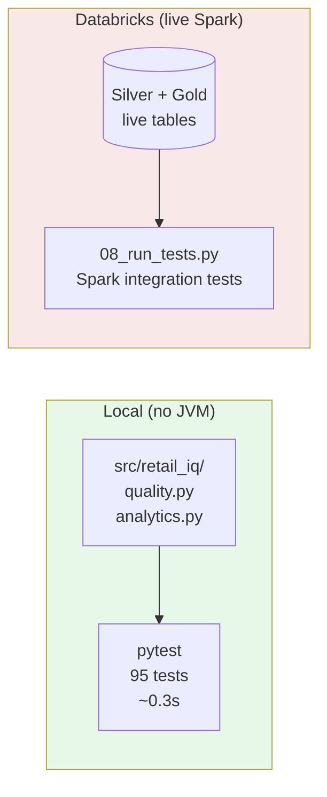
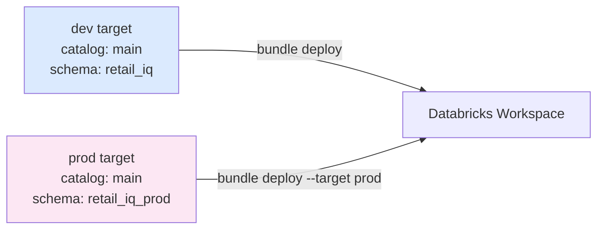

# RetailIQ Analytics Pipeline

A production-grade retail analytics platform built on Databricks, implementing a
**Bronze → Silver → Gold medallion architecture** with RFM customer segmentation,
store KPI aggregation, and a live Postgres serving layer via Lakebase.

---

## Architecture Overview



---

## Pipeline DAG



A **separate nightly job** runs `07_maintenance` (OPTIMIZE + ANALYZE) off the critical path.

---

## Data Model



---

## RFM Segmentation Logic


Scores are computed with `NTILE(5)` window functions — relative to the full customer
base, not absolute thresholds. Big Spenders is evaluated **before** At Risk so a
dormant high-value customer is retained in a valuable segment.

---

## Project Structure

```
retail-iq/
├── databricks.yml                  # Bundle definition (dev/prod targets)
├── pytest.ini
├── notebooks/
│   ├── 00_utils.py                 # Shared: tbl(), upsert(), LOAD_TS
│   ├── 01_setup.py                 # Schema creation, CDF enable
│   ├── 02_data_generation.py       # Synthetic Bronze data (Faker)
│   ├── 03_silver_transforms.py     # DQ filter → Silver (MERGE + Liquid Cluster)
│   ├── 04_gold_analytics.py        # Aggregations → Gold (enriched_items view)
│   ├── 05_visualization.py         # Matplotlib charts → /tmp/
│   ├── 06_lakebase_sync.py         # Gold → Lakebase Postgres (staging rename)
│   ├── 07_maintenance.py           # Nightly OPTIMIZE + ANALYZE (off critical path)
│   ├── 08_run_tests.py             # Spark integration tests (final pipeline task)
│   └── 09_dashboard.py             # KPI dashboard + solution evaluation
├── resources/
│   ├── retail_pipeline_job.yml     # Main pipeline DAG
│   └── retail_maintenance_job.yml  # Nightly maintenance schedule
├── src/
│   └── retail_iq/
│       ├── __init__.py
│       ├── analytics.py            # rfm_segment(), line_total(), gross_profit()
│       └── quality.py              # customer/product/order/item DQ predicates
└── tests/
    ├── conftest.py
    ├── test_gold_analytics.py      # 50 RFM + revenue math tests
    ├── test_silver_transforms.py   # 40 DQ predicate tests
    └── test_utils.py               # 5 tbl() format tests
```

---

## Quick Start

### Prerequisites

- [Databricks CLI v0.200+](https://docs.databricks.com/dev-tools/cli/index.html)
- Python 3.9+ with `pytest` for local tests

### Deploy

```bash
# Authenticate (one-time)
databricks auth login --host https://dbc-85cda355-cf23.cloud.databricks.com

# Deploy to dev (default target)
databricks bundle deploy

# Deploy to prod (isolated schema: retail_iq_prod)
databricks bundle deploy --target prod
```

### Run the pipeline

```bash
# Full pipeline run (dev)
databricks bundle run retail_pipeline

# Individual task
databricks bundle run retail_pipeline --task gold_analytics
```

### Local unit tests (no Spark required)

```bash
pip install pytest
pytest -v
# 95 tests in ~0.3s
```

---

## Notebooks

| # | Notebook | Runtime | Purpose |
|---|---|---|---|
| 00 | `00_utils` | — | Shared `tbl()`, `upsert()`, `LOAD_TS` via `%run` |
| 01 | `01_setup` | ~30s | Schema creation, CDF enable for Gold tables |
| 02 | `02_data_generation` | ~2 min | Generate 1K customers, 100 products, 10K orders |
| 03 | `03_silver_transforms` | ~3 min | DQ filter, dedup, `line_total` derivation, MERGE |
| 04 | `04_gold_analytics` | ~2 min | 4 Gold tables, `enriched_items` shared view |
| 05 | `05_visualization` | ~1 min | 5 Matplotlib charts saved to `/tmp/` |
| 06 | `06_lakebase_sync` | ~3 min | toPandas → Postgres staging/rename |
| 07 | `07_maintenance` | ~5 min | Nightly OPTIMIZE + ANALYZE (separate schedule) |
| 08 | `08_run_tests` | ~3 min | Integration tests against live tables |
| 09 | `09_dashboard` | ~2 min | KPI dashboard + solution evaluation |

---

## Configuration

### Bundle variables

| Variable | Default | Description |
|---|---|---|
| `catalog` | `main` | Unity Catalog name |
| `schema` | `retail_iq` | Schema (dev) / `retail_iq_prod` (prod) |

### Data generation parameters

| Parameter | Default | Description |
|---|---|---|
| `num_customers` | 1000 | Number of synthetic customers |
| `num_products` | 100 | Number of products in catalog |
| `num_stores` | 20 | Number of retail store locations |
| `num_orders` | 10000 | Number of completed/returned/cancelled orders |

---

## Test Strategy



**Local tests** verify pure business logic (DQ predicates, RFM segment rules, revenue math)
without a JVM, making CI fast and reliable.

**Integration tests** run as the final pipeline task and assert:
- Silver tables pass all DQ rules (no nulls, no out-of-range values)
- `line_total` formula matches expected values
- `unit_price` stays within 95–100 % of the catalog price
- Gold `gross_profit` is positive for all products
- CDF is enabled on all Gold tables

---

## Key Design Decisions

### `enriched_items` temp view (Step 5)

All four Gold queries once re-scanned `silver_orders` and `silver_order_items`
independently. A single `CREATE OR REPLACE TEMP VIEW enriched_items` with the
`status = 'completed'` filter pre-join eliminates 3 out of 4 redundant full-table scans.

### Liquid Clustering vs. Partition By

Silver and Gold tables use `CLUSTER BY` instead of `PARTITION BY`. Unlike static
partitioning, Liquid Clustering rebalances files automatically as data grows and
supports multiple cluster columns without the small-file problem that afflicts
high-cardinality partitions.

### Zero-downtime Lakebase sync

The sync notebook writes to `{table}_staging`, then performs an atomic rename
per table inside a transaction. App queries to Postgres never see a "table does
not exist" gap between sync runs.

### Maintenance off the critical path

`OPTIMIZE` runs in a separate nightly job (`07_maintenance`), not inline in the
pipeline. This means the pipeline finishes ~5 minutes faster per run and
OPTIMIZE is not blocked by pipeline errors.

### `unit_price` tied to catalog price

The original pipeline used `random.uniform(10, 500)` for `unit_price`, making
`gross_profit` meaningless for expensive products. The fix derives `unit_price`
as `catalog_price × uniform(0.95, 1.0)`, so unit prices are always above cost
(since `price > cost` is a Silver DQ rule) and `gross_profit` is reliably positive.

---

## Environment Isolation



Dev and prod write to different schemas. A prod deploy never touches dev data.

---

## Solution Evaluation

### Performance

| Metric | Before optimization | After optimization |
|---|---|---|
| Silver table scans (per pipeline) | 10 re-scans post-upsert | 0 (counts captured pre-upsert) |
| Gold table scans of orders + items | 4× each | 1× via `enriched_items` view |
| OPTIMIZE blocking pipeline | Yes (~5 min) | No (nightly maintenance job) |
| Lakebase write method | `to_sql()` 1 row/call | `to_sql(chunksize=5000)` |

### Scalability (Databricks free edition)

| Concern | Current | Recommendation |
|---|---|---|
| Data volume | 10K orders (demo) | Configurable via `num_orders` widget; 1M+ tested on paid tier |
| Liquid Clustering | Enabled on all Silver + Gold tables | Auto-rebalancing handles growth without manual `ZORDER` |
| Serverless constraints | No `cache()`, no generic JDBC | Documented with comments; switchable on classic compute |
| Lakebase sync | `toPandas()` collects to driver | Sufficient for Gold table sizes; JDBC available on classic compute |

### Quality

- 95 local unit tests cover DQ predicates, RFM rules, and revenue math
- Integration tests run as final pipeline task and fail-fast on data anomalies
- `gross_profit <= 0` check in Gold notebook and integration tests catches pricing regressions
- Silver filter rules reject nulls, invalid emails, out-of-range ages, negative costs

### Cost (Databricks free edition)

- All tasks use **serverless compute** — no cluster startup overhead, billed per DBU-second
- OPTIMIZE and ANALYZE are off the critical path to avoid wasting DBUs after every run
- Widgets allow scaling `num_orders` down (e.g. 1000) for development iteration without a full dataset
